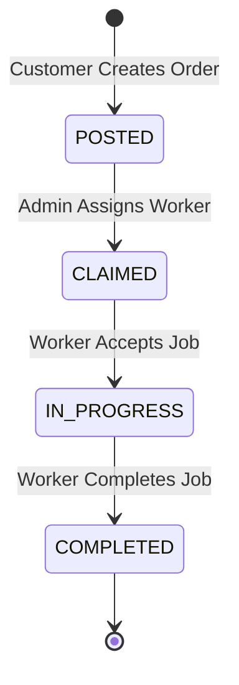
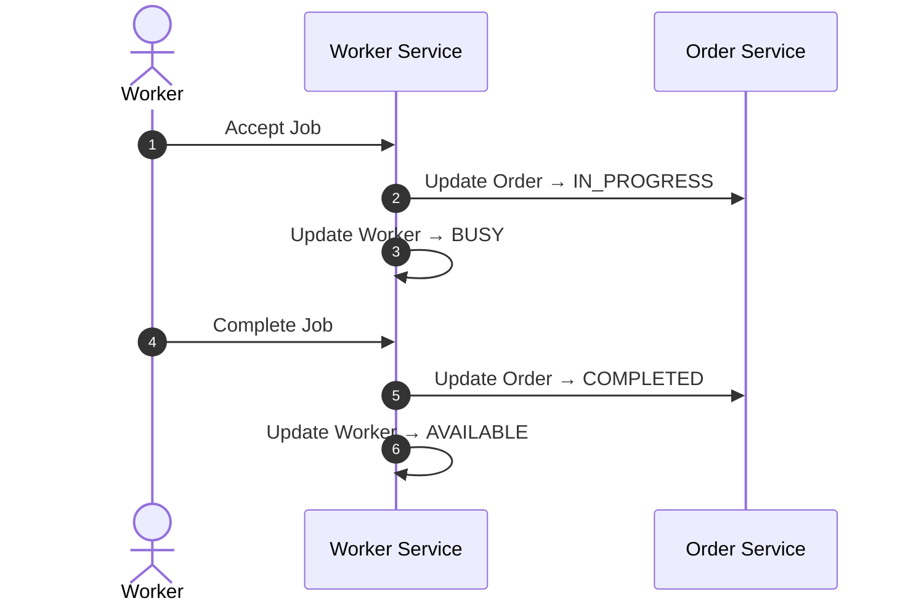

# 🚀 Carelio - Smart Home Appliance Care & Service Ecosystem

Carelio is a **modern microservices-based backend ecosystem** designed to:

* 🏠 Manage household appliances digitally
* 🧾 Track maintenance history
* 🔧 Connect users with professional technicians
* 🛒 Enable an integrated service-commerce platform

---

## 🏗️ System Architecture

The system is built using a **microservices architecture** to ensure:

* High scalability
* Fault isolation
* Independent deployment

### 🔹 Core Services

| Service                   | Port   | Responsibility                                          |
| ------------------------- | ------ | ------------------------------------------------------- |
| **Household Service**     | `8082` | Asset management, appliance catalog, room grouping      |
| **Worker Service**        | `8083` | Technician onboarding, profiles, ratings, skill mapping |
| **Service Order Service** | `8084` | Order lifecycle & workflow orchestration                |

---

## 🚦 Business Workflow (State Machine)

The system enforces strict state transitions for **data consistency across services**:



### 📌 State Definitions

| State           | Description               |
| --------------- | ------------------------- |
| **POSTED**      | Order created by customer |
| **CLAIMED**     | Assigned to a technician  |
| **IN_PROGRESS** | Work started              |
| **COMPLETED**   | Work finished             |

---

## 🔄 Inter-Service Communication

Services communicate via **Spring Cloud OpenFeign**.

### 🧬 Sequence Flow



### 🔑 Key Logic

* Worker must be **AVAILABLE** to accept a job
* Worker becomes **BUSY** when job starts
* Worker becomes **AVAILABLE again** after completion
* Order state strictly follows lifecycle rules

---

## 🛠️ Infrastructure (Docker + PostgreSQL)

Each microservice has its own **isolated database**.

### 📊 Database Configuration

| Service   | Container            | Port   | Database       | User                |
| --------- | -------------------- | ------ | -------------- | ------------------- |
| Household | `household-postgres` | `5434` | `household_db` | `household_service` |
| Worker    | `worker-postgres`    | `5435` | `worker_db`    | `worker_service`    |
| Order     | `order-postgres`     | `5436` | `order_db`     | `order_service`     |

---

## 🚀 Getting Started

### 🔧 Prerequisites

* Java **JDK 17**
* Maven **3.8+**
* Docker & Docker Compose

---

### 1️⃣ Start Databases

```bash
docker-compose up -d
```

Verify:

```bash
docker ps
```

---

### 2️⃣ Run Microservices

Run each service in separate terminals:

```bash
mvn clean compile spring-boot:run
```

---

### 3️⃣ API Documentation

* Worker Service: http://localhost:8083/swagger-ui.html
* Order Service: http://localhost:8084/swagger-ui.html

---

## ⚙️ Configuration & Troubleshooting

### 🔹 Enable Bean Overriding

```properties
spring.main.allow-bean-definition-overriding=true
```

### 🔹 Feign Client Rules

* Use correct URLs:

```
http://localhost:<port>
```

* Avoid whitespace or malformed endpoints

---

## 📌 Tech Stack

* ☕ Java 17 + Spring Boot
* ☁️ Spring Cloud OpenFeign
* 🐘 PostgreSQL 16
* 🐳 Docker & Docker Compose
* 📄 OpenAPI (Swagger)

---

## 💡 Future Improvements

* API Gateway integration
* Service Discovery (Eureka / Consul)
* Authentication (JWT / OAuth2)
* Observability (Prometheus + Grafana)
* CI/CD pipelines

---

## 🤝 Contributing

Contributions are welcome! Feel free to:

* Fork the repository
* Create feature branches
* Submit pull requests

---

## 📄 License

This project is licensed under the MIT License.
